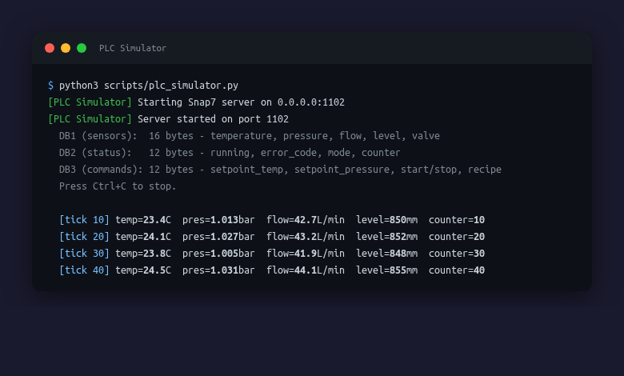
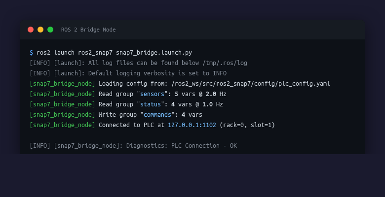
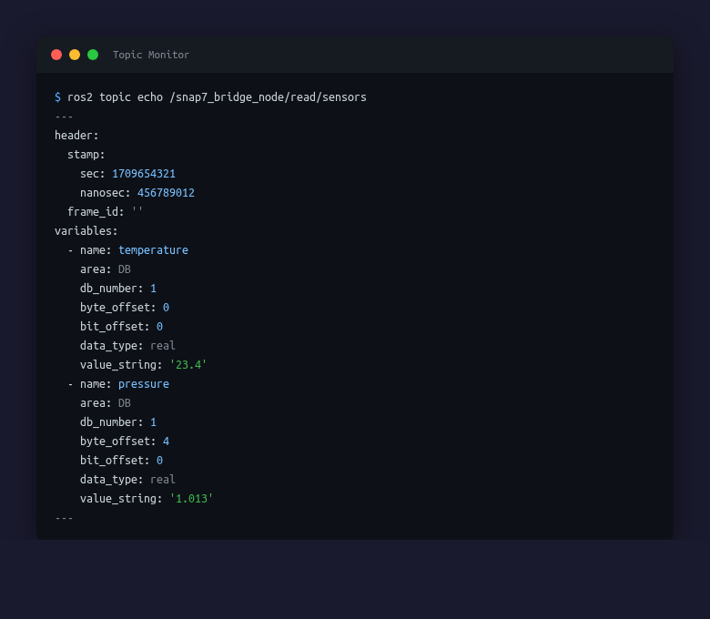
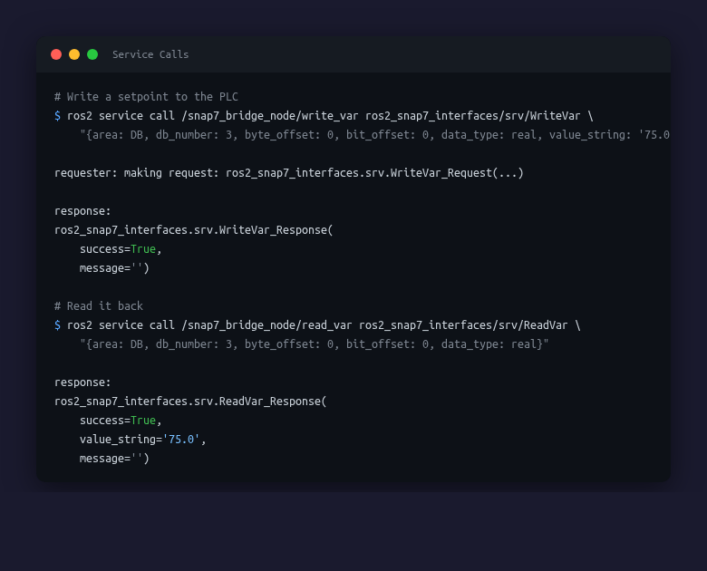

# ros2_snap7

A ROS 2 driver for Siemens S7 PLCs (S7-300/S7-1200/S7-1500) using the [Snap7](http://snap7.sourceforge.net/) library and the PUT/GET communication protocol.

## Features

- **Read & Write** S7 data areas (DB, Inputs, Outputs, Merkers, Counters, Timers)
- **Supported data types**: Bool, Byte, Int, Word, DInt, DWord, Real, String
- **Configurable polling groups** with independent rates (YAML-based)
- **Write groups** with variable-name validation (prevents arbitrary writes)
- **Auto-reconnection** on connection loss
- **Thread-safe** Snap7 wrapper with `ReentrantCallbackGroup` + `MultiThreadedExecutor`
- **Diagnostics** via ROS 2 `diagnostic_updater`
- **Custom interfaces**: `PlcVariable`, `PlcData`, `PlcState` messages; `ReadVar`, `WriteVar`, `GetCpuInfo` services

## Architecture

```
┌──────────────────────────────────────────────┐
│              snap7_bridge_node               │
│                                              │
│  ┌─────────┐  ┌──────────┐  ┌────────────┐  │
│  │  Timers  │  │  Subs    │  │  Services  │  │
│  │ (read)   │  │ (write)  │  │ read/write │  │
│  └────┬─────┘  └────┬─────┘  └─────┬──────┘  │
│       │              │              │         │
│       └──────────┬───┘──────────────┘         │
│                  │                            │
│          ┌───────▼───────┐                    │
│          │   S7Client    │                    │
│          │ (thread-safe) │                    │
│          └───────┬───────┘                    │
│                  │                            │
└──────────────────┼───────────────────────────┘
                   │ TCP/ISO-on-TCP
           ┌───────▼───────┐
           │  Siemens PLC  │
           │ S7-300/1200/  │
           │    1500       │
           └───────────────┘
```

## Demo

The project includes a PLC simulator for hardware-free testing:

### 1. Start the PLC Simulator


### 2. Launch the ROS 2 Bridge Node


### 3. Monitor Live Sensor Data


### 4. Read/Write via Service Calls


> To run this demo yourself, start the simulator with
> `python3 scripts/plc_simulator.py` and use `plc_config_demo.yaml`.

## Packages

| Package | Description |
|---------|-------------|
| `ros2_snap7` | Python ROS 2 node, S7 client wrapper, config parser |
| `ros2_snap7_interfaces` | Custom message and service definitions |

## Quick Start

### Prerequisites

- ROS 2 Humble (or later)
- Python 3.10+
- `python-snap7` library (`pip install "python-snap7>=1.2,<2.0"`)
- Snap7 shared library (`libsnap7.so`) installed on your system

### Build

```bash
cd ~/ros2_ws
colcon build --packages-select ros2_snap7_interfaces
source install/setup.bash
colcon build --packages-select ros2_snap7 --symlink-install
source install/setup.bash
```

### Configure

Edit the config file at `src/ros2_snap7/config/plc_config.yaml` to match your PLC setup.

### Run

```bash
ros2 launch ros2_snap7 snap7_bridge.launch.py
```

Or with a custom config:

```bash
ros2 launch ros2_snap7 snap7_bridge.launch.py config_file:=/path/to/your/config.yaml
```

## Topics

| Topic | Type | Description |
|-------|------|-------------|
| `~/read/<group_name>` | `ros2_snap7_interfaces/PlcData` | Polled PLC data per read group |
| `~/write/<group_name>` | `ros2_snap7_interfaces/PlcData` | Subscribe to write variables to PLC |
| `~/state` | `ros2_snap7_interfaces/PlcState` | PLC connection state and counters |

## Services

| Service | Type | Description |
|---------|------|-------------|
| `~/read_var` | `ros2_snap7_interfaces/ReadVar` | Read a single PLC variable |
| `~/write_var` | `ros2_snap7_interfaces/WriteVar` | Write a single PLC variable |
| `~/get_cpu_info` | `ros2_snap7_interfaces/GetCpuInfo` | Get PLC CPU information |

## PLC Configuration (PUT/GET)

For S7-1200/1500, you must enable PUT/GET communication:
1. In TIA Portal, open the PLC properties
2. Navigate to **Protection & Security** > **Connection mechanisms**
3. Enable **Permit access with PUT/GET communication**

## License

Apache License 2.0 -- see [LICENSE](LICENSE) for details.

## Contributing

See [CONTRIBUTING.md](CONTRIBUTING.md) for guidelines.
